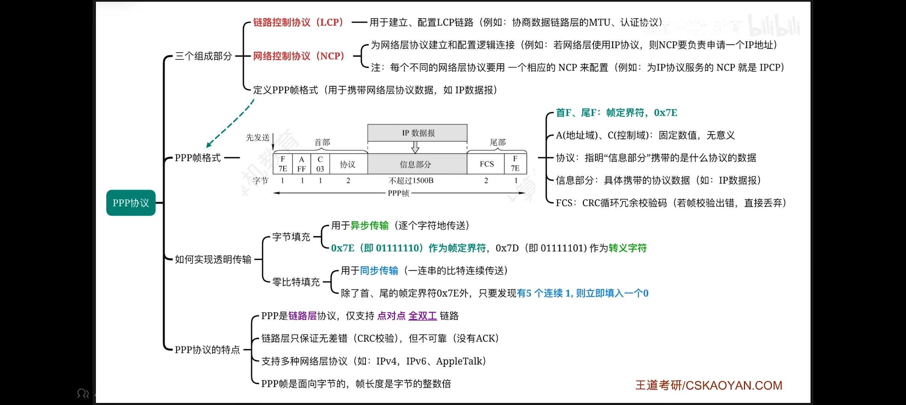
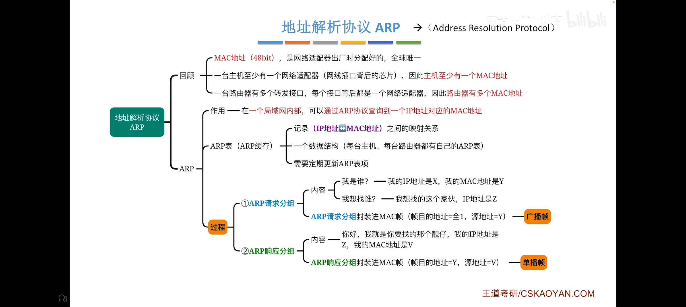
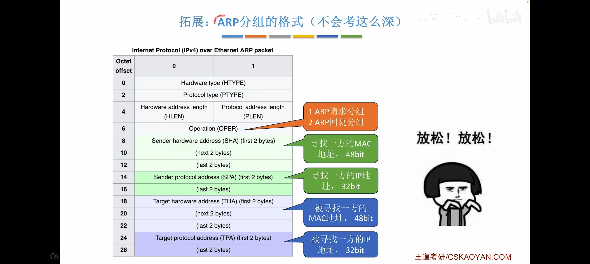
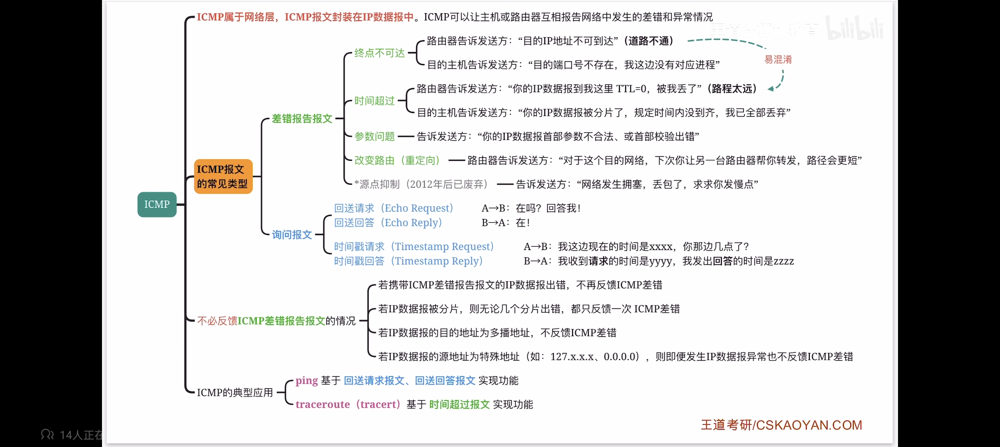
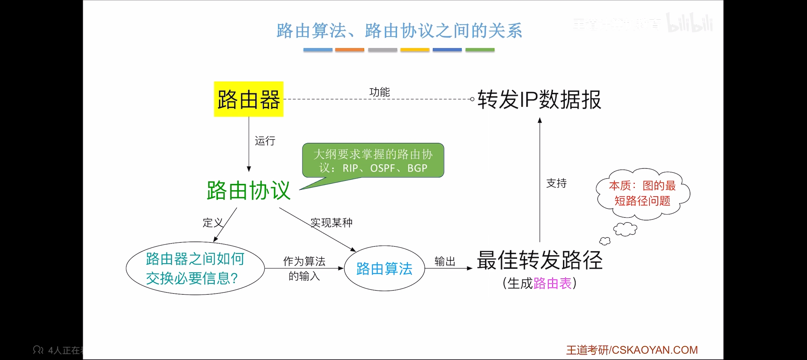
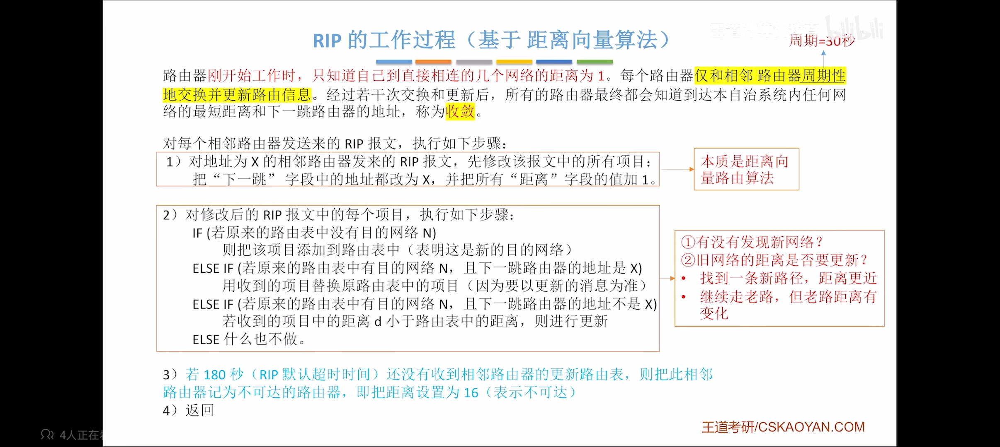

## 此笔记基于王道
TCP/IP五层模型：物理层，数据链路层，网络层，传输层，应用层   
OSI参考模型：物理层，数据链路层，网络层，运输层，会话层，表示层，应用层   
### 数据链路层    
- 停止等待协议（S-W）：滑动窗口机制、确认机制（确认帧ACK）、超时重传，可以实现流量控制、可靠传输  
- 后退N帧协议（GBN）：滑动窗口机制、确认帧（可以累计确认）、超时重传（若未收到第i个帧，则重传i帧及其之后的所有帧）  
- 选择重传协议（SR）：滑动窗口机制（发送窗口>1，接收窗口>1，接收窗口不能大于发送窗口）、确认机制（不能累计确认，新增否定帧NAK）、超时重传、请求重传  
- ALOHA协议：纯ALOHA、时隙ALOHA
    - 纯ALOHA：立即发送，未收到ACK则随机等待一段时间后重传
    - 时隙ALOHA：时隙大小固定
- CSMA/CD协议：先听后发，边听边发，冲突停发，随机重发（第10次冲突为分水岭，第16此次冲突时放弃传帧并报告网络层）
- CSMA/CA协议：先听后发，忙则随机退避（用二进制指数退避算法确定随机退避时间），可选信道预约机制（发送方广播RTS控制帧、AP广播CTS控制帧、其余无关节点收到CTS后会禁言）
- 点对点协议（PPP协议）：由链路控制协议（LCP）、网络控制协议（NCP）和PPP帧格式构成
    - LCP：用于建立、配置LCP链路（例如协商数据链路层的MTU、认证协议）
    - NCP：为网络层协议建立和配置逻辑链接（例如：网络层使用IP协议，则NCP要负责申请一个IP地址，每个不同的网络层协议都要有一个相应的NCP来配置）
    
    
### 网络层  
- 地址解析协议（ARP协议）：
    
       
- 动态主机配置协议（DHCP）：
    
    
- 网际控制报文协议（ICMP）：
    
- 路由信息协议（RIP）：
    
    
    
    
- 开发最短路径优先协议（OSPF）:
  
	 
